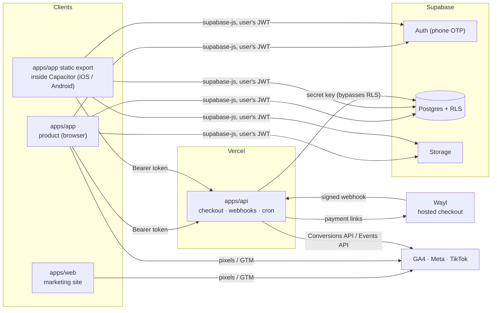
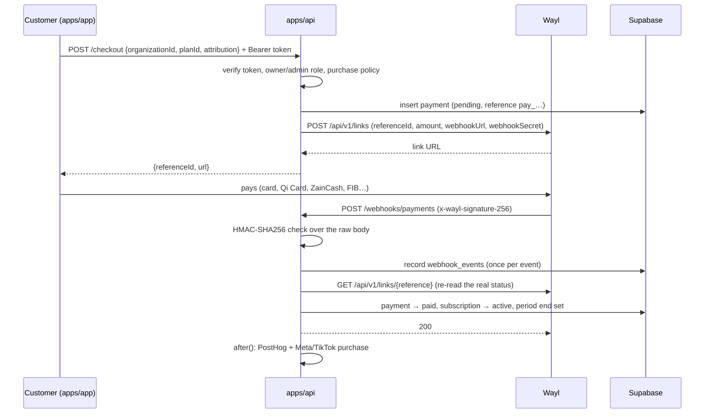

# Architecture and integrations guide

This guide is for the people who set up, run and hand over a project built on
this monorepo: consultants, tech leads and the developers who maintain it. It
explains how the pieces fit together and walks through each integration step
by step.

| Section | You need it when you… |
| --- | --- |
| [Architecture at a glance](#architecture-at-a-glance) | join the project or review a change |
| [1. Create a project from the template](#1-create-a-project-from-the-template) | start a new client or product |
| [2. Supabase migrations and Row Level Security](#2-supabase-migrations-and-row-level-security) | change the database or its access rules |
| [3. Build, sync and release the iOS and Android apps](#3-build-sync-and-release-the-ios-and-android-apps) | ship the mobile apps |
| [4. Marketing tracking and Wayl payments](#4-marketing-tracking-and-wayl-payments) | set up ads attribution or take real payments |
| [5. Vercel environment variables](#5-vercel-environment-variables) | deploy the web apps |

`AGENTS.md` holds the short list of coding rules; this document is the long
form.

---

## Architecture at a glance



### The apps

| App | Port | What it is | How it is deployed |
| --- | --- | --- | --- |
| `apps/web` | 3001 | Marketing site: home, pricing, blog, legal, contact. Server-rendered Next.js with `next-intl` locale routing (`/ar/…`, `/en/…`). | Vercel |
| `apps/app` | 3000 | The product. **Client-first**: every screen renders in the browser and talks to Supabase directly. The same code is built twice: a normal Next.js build for the web, and a static export for the native apps. | Vercel (web) and the App Store / Google Play (native) |
| `apps/api` | 3002 | Everything that needs a secret: Wayl checkout and webhooks, cron jobs, account and organization deletion, the Liveblocks and Svix token endpoints. Route handlers only. | Vercel |
| `apps/email` | 3003 | React Email templates (`@repo/email`). | Not deployed (dev preview) |
| `apps/docs` | 3004 | Mintlify documentation site. | Mintlify |
| `apps/storybook` | 6006 | Design-system workbench. | Optional |

### Principles that shape the code

1. **Row Level Security is the security boundary.** The product app queries
   Postgres with the signed-in user's token, so the database decides what each
   user can read and write. Client-side checks such as `RequireAuth` or
   `canManage` only decide what to *show*.
2. **Secrets live in `apps/api` and Supabase, never in `apps/app`.** Anything
   the iOS/Android bundle contains can be extracted, so `apps/app` only has
   `NEXT_PUBLIC_*` variables. When it needs a privileged action, it calls
   `apps/api` with `callApi()` (`apps/app/lib/api.ts`), which sends the user's
   access token as `Authorization: Bearer …` and the client platform as
   `x-client-platform`. The API verifies the token (`authenticateRequest`),
   checks the caller's role in the organization (`apps/api/lib/membership.ts`)
   and only then uses the admin client.
3. **One source of truth for project settings.** `packages/config/project.json`
   holds the organization and project names, URL, bundle id, locales, region
   (Iraq, `Asia/Baghdad`, IQD, Latin digits, Saturday week start) and the
   commerce mode. Read it through `@repo/config`.
4. **Arabic first, English second.** Every UI string comes from
   `packages/internationalization/messages/{ar,en}.json`. Layouts use logical
   Tailwind utilities so they mirror in RTL. `bun run check:i18n` and
   `bun run check:rtl` enforce both rules in CI.
5. **Optional modules are removable.** CMS, collaboration, notifications,
   outbound webhooks, feature flags, rate limiting and AI helpers are wrapped in
   `<module:id>` markers so `bun run init` can delete them cleanly.

### How a request flows

| Flow | Path |
| --- | --- |
| Sign in | Phone number → `supabase.auth.signInWithOtp` → SMS (Send SMS hook) → code → `verifyOtp` → session. On the web the session is kept in cookies; in the apps it is kept in the Keychain or Keystore. |
| Read or write data | Screen → TanStack Query hook (`apps/app/lib/queries.ts`) → `supabase.from(…)` with the user's JWT → RLS policies. |
| Create an organization | Onboarding form → `rpc("create_organization")`, which inserts the organization and the caller's `owner` membership in one transaction. |
| Privileged action | Screen → `callApi(supabase, "/checkout", …)` → `apps/api` verifies the token and role → admin client or third-party API. |
| Payment | `/checkout` → Wayl payment link → customer pays on Wayl → signed webhook → `/webhooks/payments` → payment and subscription updated → purchase reported to analytics. |

### Locale routing in the product app

`apps/app` must also work as a set of static files inside a native WebView,
where there is no server to run middleware or redirects. It therefore uses:

- a `[locale]` route segment with `generateStaticParams` and
  `dynamicParams = false`, so `/ar/…` and `/en/…` are prerendered;
- an entry page (`app/page.tsx`) that picks the saved or device language and
  redirects with the client router;
- a small inline bootstrap script in the root layout that sets `<html lang dir>`
  before the first paint and remembers the original path. Capacitor serves the
  root `index.html` for every unknown path, so a reload on `/ar/billing` still
  lands on the right screen;
- a root not-found page that adds the language to unprefixed paths
  (`/billing` → `/ar/billing`) and shows a localized 404 otherwise.

Inside `apps/app`, link with `Link` and `useRouter` from
`@repo/internationalization/navigation` so URLs keep their language prefix.

---

## 1. Create a project from the template

> **Two kinds of "organization".** The *template organization* is the client
> or company the codebase is created for. It is set once by `bun run init`.
> *Tenant organizations* are the workspaces end users create inside the
> product (teams, companies, clinics…). They are rows in the `organizations`
> table and are covered at the end of this section.

### 1.1 Prerequisites

- Node.js 22 or newer (`.nvmrc`) and Bun (the version is pinned in the root
  `package.json` under `packageManager`).
- Docker, to run Supabase locally.
- A fresh copy of the template: GitHub's **Use this template** button, or
  `git clone` followed by pointing `origin` at the client's repository.

### 1.2 Run the generator

```sh
bun install
bun run init
```

The interactive CLI asks for each value, shows a summary and applies it after
you confirm. For scripted setups, pass every value as a flag:

```sh
bun run init --yes \
  --org-name "شركة الرافدين" \
  --org-slug rafidain \
  --project-name "Rafidain Booking" \
  --project-slug rafidain-booking \
  --project-url https://booking.rafidain.iq \
  --support-email support@rafidain.iq \
  --bundle-id iq.rafidain.booking \
  --default-locale ar \
  --commerce physical \
  --keep-modules cms,rate-limit
```

| Flag | Asked as | Used for | Default |
| --- | --- | --- | --- |
| `--org-name` | Organization name | Legal and footer text, emails. Any script (Arabic is fine). | required |
| `--org-slug` | Organization slug | Identifiers and the default repository URL | slug of the name |
| `--project-name` | Project name | Product name in the UI, app stores, metadata | required |
| `--project-slug` | Project slug | Root package name | slug of the name |
| `--project-url` | Public website URL | Canonical URLs, sitemaps, emails | `https://<project-slug>.iq` |
| `--support-email` | Support email | Contact and security addresses | `support@<domain>` |
| `--repo-url` | Repository URL | README and docs links | the `origin` remote |
| `--bundle-id` | iOS/Android app ID | Capacitor `appId`, the deep-link scheme | reversed domain + slug |
| `--default-locale` | Default language | `project.locale.default` | `ar` |
| `--commerce` | What does this project sell? | `project.commerce.allowNativeCheckout` | `digital` |
| `--keep-modules` | Optional modules to keep | Everything else is deleted | all modules |
| `--skip-install` | | Skip `bun install` and code tidying | off |
| `--root` | | Initialize another directory | current directory |

`bun run init --help` prints the same list.

### 1.3 What the generator does

In order:

1. **Refuses to run twice.** If `packages/config/project.json` no longer holds
   placeholders, the repository is already initialized and init stops.
2. **Fills in placeholder tokens.** Every text file is scanned for the
   double-brace tokens (organization name and slug, project name, slug and URL,
   support email, repository URL, bundle id, year) and each one is replaced.
3. **Applies project settings.** Sets the default locale and the commerce mode
   in `project.json`, and renames the root package.
4. **Removes the modules you didn't keep.** It deletes their packages and
   files, removes `<module:id>` … `</module:id>` blocks from shared files (TS,
   JSX, env files, YAML) and drops their dependencies from every
   `package.json`.
5. **Removes template-only files.** That means `scripts/init.ts`,
   `scripts/template/`, the template CI workflow and the `init` and
   `test:template` scripts.
6. **Creates `.env.local` files** next to every `.env.example`. Existing files
   are never overwritten.
7. **Installs and tidies.** Runs `bun install`, then Biome, to remove imports
   and variables left unused by the removed modules.
8. **Verifies.** Runs `bun run check:placeholders`, which fails if any token
   or unbalanced module marker is left.

#### Optional modules

| Id | Module | Removes |
| --- | --- | --- |
| `cms` | Blog and legal pages edited in BaseHub | `packages/cms`, the blog and legal routes, the footer's legal column |
| `collaboration` | Live cursors and presence (Liveblocks) | `packages/collaboration`, `apps/app/components/collaboration`, `apps/api/app/collaboration` |
| `notifications` | In-app notification feed (Knock) | `packages/notifications`, the app's notifications provider |
| `webhooks` | Outbound webhooks and a customer portal (Svix) | `packages/webhooks`, the webhooks screen, `apps/api/app/webhooks/portal` |
| `feature-flags` | Vercel Flags with PostHog decisions | `packages/feature-flags`, `apps/web/app/.well-known` |
| `rate-limit` | Upstash rate limiting | `packages/rate-limit` |
| `ai` | AI SDK helpers and chat components | `packages/ai` |

#### Choosing the commerce mode

| Mode | Choose it when the project sells… | Effect |
| --- | --- | --- |
| `digital` | Subscriptions, SaaS seats, digital content | Checkout is web-only. Inside the iOS/Android apps the billing screen explains that plans are managed on the website, and `apps/api` rejects native checkout requests. App Store guideline 3.1.1 and Google Play's payments policy require their own billing for digital goods. |
| `physical` | Physical goods or real-world services (retail, bookings, delivery) | Wayl checkout is allowed in the apps too (it opens in the system browser). Both stores allow third-party payment for these (App Store guideline 3.1.3(e)). |

The rule lives in `getPurchasePolicy()` (`packages/payments/policy.ts`) and is
enforced by the client and again by `apps/api/app/checkout`.

### 1.4 After init

1. Review the diff and commit it: `git add -A && git commit -m "Initialize project"`.
2. Start Supabase locally and fill in `.env.local` files
   ([section 2](#2-supabase-migrations-and-row-level-security)).
3. Run `bun run dev`. The app is at http://localhost:3000, the site at
   http://localhost:3001 and the API at http://localhost:3002.
4. Create the Supabase project, the three Vercel projects and their
   environment variables ([section 5](#5-vercel-environment-variables)).
5. Create the native projects ([section 3](#3-build-sync-and-release-the-ios-and-android-apps)).

To change regional settings later (time zone, currency, enabled languages),
edit `packages/config/project.json`. Do **not** change `bundleId` after a
store release: the stores treat a new id as a different app.

### 1.5 Tenant organizations in the product

New users go through a two-step onboarding (`/[locale]/onboarding`):

1. **Profile:** name and preferred language (`profiles.full_name`,
   `profiles.locale`). The language choice also switches the UI.
2. **Organization:** name and an address slug (lowercase Latin letters,
   digits and hyphens, 2–64 characters). Arabic names have no Latin letters
   to derive a slug from, so the form suggests `org-<random>`, which the user
   can edit. Submitting calls the `create_organization` RPC,
   which creates the organization and makes the caller its `owner` in one
   transaction. A taken slug shows "already in use" (Postgres error `23505`).

If someone has invited the user's phone number or email, onboarding lists the
pending invitations first (`pending_invitations()` RPC). Accepting one joins
that organization instead (`accept_invitation`). Invitation links
(`/[locale]/invite?token=…`) work too.

Later, users create more organizations from the sidebar's organization switcher
(`/[locale]/organizations/new`). The active organization is remembered per
device (`apps/app/lib/active-organization.ts`); it is a UI preference, not a
permission. Roles are `owner`, `admin` and `member`:

| Action | owner | admin | member |
| --- | :-: | :-: | :-: |
| See the organization, its members and projects | ✓ | ✓ | ✓ |
| Create and rename projects | ✓ | ✓ | ✓ |
| Rename the organization, invite and remove members, change roles | ✓ | ✓ | |
| See payments, start a checkout, open the webhook portal | ✓ | ✓ | |
| Delete the organization | ✓ | | |

An organization always keeps at least one owner (a trigger enforces it).

### 1.6 Account deletion

Apple (guideline 5.1.1(v)) and Google Play require apps that let users create
accounts to let them delete those accounts in the app. Users find it under
**Settings → Delete account**, and on the onboarding screen for people who
haven't joined an organization yet.

**Organization ownership.** A user may be the only owner of an organization.
Deleting their account would leave it without an owner, so they must resolve
it first. When the dialog opens, it calls `account_deletion_blockers()`, which
lists each organization the user alone owns and how many other members it
has. For each one, the user either:

- **makes another member an owner** (offered when the organization has other
  members; RLS only lets owners grant the owner role), or
- **deletes the organization**, after typing its address. This calls
  `POST /organizations/delete` in `apps/api`. The delete runs as the user, so
  the owners-only policy applies. Projects, memberships, invitations and the
  subscription go with it, payment records are kept with the organization
  cleared, and the `org-files/<organization id>/` folder is removed.

Once no blockers remain, the user types a confirmation phrase ("delete my
account" or «احذف حسابي»). `POST /account/delete` then:

1. checks `account_deletion_blockers()` again, and answers `409` with the
   list if a new one appeared, which takes the dialog back to that step;
2. removes the user's `avatars/<user id>/` folder (storage objects have no
   foreign key to users);
3. deletes the auth user with the admin API. That cascades to the profile
   and memberships and clears `created_by`, `invited_by` and
   `payments.user_id`.

The database is the final guard: `private.protect_last_owner` refuses to
remove the last owner's membership, so even a request that skips the checks
cannot orphan an organization. The app then clears the local session,
analytics identity and stored organization, and the sign-in page confirms the
deletion. The pgTAP suite (`rls.test.sql`) and `apps/api/__tests__/deletion.test.ts`
cover these rules.

---

## 2. Supabase migrations and Row Level Security

### 2.1 Where things live

```
packages/database/
  supabase/
    config.toml            local stack settings (auth, SMS test numbers, redirect URLs)
    migrations/            ordered SQL migrations: the schema's history
    tests/database/        pgTAP tests (RLS and RPC behaviour)
    seed.sql               local seed data (plans)
    functions/send-sms/    Send SMS auth hook (Edge Function)
  types.ts                 generated TypeScript types (do not edit)
  admin.ts                 service-role client; bypasses RLS (server only)
```

Current schema:

| Migration | Contents |
| --- | --- |
| `…_tenancy.sql` | `profiles`, `organizations`, `memberships`, `invitations`, `projects`; RLS helpers in the `private` schema; `create_organization` and `accept_invitation` RPCs; last-owner protection |
| `…_billing.sql` | `plans`, `subscriptions`, `payments`, `webhook_events` (idempotency) |
| `…_storage.sql` | `org-files` (private) and `avatars` (public) buckets with path-based policies |
| `…_pending_invitations.sql` | `pending_invitations()` RPC for onboarding |
| `…_account_deletion.sql` | `account_deletion_blockers()`: organizations the caller alone owns (see 1.6) |

### 2.2 Run the database locally

```sh
bun run db:start     # starts Postgres, Auth, Storage, Studio in Docker; applies migrations + seed
bun run db:reset     # drops the local database and re-applies migrations + seed
bun run db:test      # runs the pgTAP tests
bun run db:types     # regenerates packages/database/types.ts
bun run db:stop
```

`bunx supabase status` (from `packages/database`) prints the local URLs and
keys. Put `API_URL` and `PUBLISHABLE_KEY` into `NEXT_PUBLIC_SUPABASE_URL` and
`NEXT_PUBLIC_SUPABASE_PUBLISHABLE_KEY`, and `SECRET_KEY` into
`SUPABASE_SECRET_KEY` (API only). The publishable key starts with
`sb_publishable_`; the older JWT "anon" key is rejected by env validation.

Local phone sign-in uses test numbers from `config.toml`
(`[auth.sms.test_otp]`). `+964 770 000 0000` and `+964 770 000 0901` accept
the code `123456`, and no SMS is sent.

### 2.3 Change the schema

1. **Create a migration file.**

   ```sh
   bun run --cwd packages/database migration:new add_bookings
   ```

   This creates `supabase/migrations/<timestamp>_add_bookings.sql`. You can
   also make the change in local Studio (http://localhost:54323) and run
   `bun run --cwd packages/database db:diff -f add_bookings` to generate the
   SQL. Always read and clean up the generated file.

2. **Write the SQL** following the checklist below.
3. **Apply it locally:** `bun run db:reset`.
4. **Regenerate types:** `bun run db:types`. CI fails if `types.ts` is out of
   date.
5. **Write tests** in `supabase/tests/database/` and run `bun run db:test`.
6. **Lint:** `bun run --cwd packages/database db:lint`.
7. Commit the migration, the tests and `types.ts` together.

Never edit a migration that has been applied to a shared database. Fix
forward with a new migration.

#### Checklist for a new table

- [ ] `alter table … enable row level security;` in the same migration that
      creates the table. A table without RLS is readable by anyone holding the
      publishable key.
- [ ] One policy per operation (`select`, `insert`, `update`, `delete`) that
      needs one. Name it in plain English.
- [ ] Use the helpers instead of re-implementing membership checks:
      `private.is_org_member(org_id)`,
      `private.has_org_role(org_id, array['owner','admin']::public.org_role[])`
      and `private.shares_org_with(user_id)`.
- [ ] Write `(select auth.uid())`, not `auth.uid()`, so Postgres evaluates it
      once per query instead of once per row.
- [ ] Never authorize with `auth.jwt() -> 'user_metadata'`: users can edit it.
- [ ] `revoke all` from `anon, authenticated`, then grant only what the app
      needs, column by column for `insert` and `update`. Column grants stop a
      user from setting `created_by`, `organization_id` or `role` to something
      they shouldn't.
- [ ] Index foreign keys and every column a policy filters on.
- [ ] `security definer` functions go in the `private` schema (or are
      explicitly granted), with `set search_path = ''` and fully qualified
      names.
- [ ] Add `set_updated_at` triggers for tables with `updated_at`.

Example: organization-scoped bookings that members can read and create, and
only owners and admins can cancel.

```sql
create table public.bookings (
  id uuid primary key default gen_random_uuid(),
  organization_id uuid not null references public.organizations (id) on delete cascade,
  starts_at timestamptz not null,
  customer_phone text not null check (customer_phone ~ '^\+[0-9]{8,15}$'),
  created_by uuid not null default auth.uid() references public.profiles (id),
  created_at timestamptz not null default now()
);

create index bookings_organization_id_starts_at_idx
  on public.bookings (organization_id, starts_at);

alter table public.bookings enable row level security;

create policy "Members see their organization's bookings"
  on public.bookings for select to authenticated
  using ((select private.is_org_member(organization_id)));

create policy "Members create bookings"
  on public.bookings for insert to authenticated
  with check (
    (select private.is_org_member(organization_id))
    and created_by = (select auth.uid())
  );

create policy "Owners and admins cancel bookings"
  on public.bookings for delete to authenticated
  using (
    (select private.has_org_role(
      organization_id, array['owner', 'admin']::public.org_role[]
    ))
  );

revoke all on public.bookings from anon, authenticated;
grant select, delete on public.bookings to authenticated;
grant insert (organization_id, starts_at, customer_phone) on public.bookings to authenticated;
grant all on public.bookings to service_role;
```

### 2.4 Test the policies

RLS tests are pgTAP files run inside a transaction that is rolled back.
`rls.test.sql` shows the pattern: insert fixtures as the superuser, then switch
identity with the helpers and assert what each user can see or do.

```sql
select pg_temp.login_as('00000000-0000-0000-0000-00000000000b'); -- a member of org one

select is(
  (select count(*) from public.bookings),
  1::bigint,
  'Members only see their own organization''s bookings'
);

-- A policy that doesn't match filters rows instead of raising an error:
-- the delete runs but returns nothing.
select is_empty(
  'delete from public.bookings returning id',
  'Members cannot cancel bookings'
);

-- No grants at all for anon: the query itself is refused.
select pg_temp.login_anon();
select throws_ok(
  'select * from public.bookings',
  '42501',
  null,
  'Anonymous users cannot read bookings'
);
```

Remember to raise `select plan(n);` at the top by the number of tests you add.
For every policy, cover at least: the allowed user succeeds, a user from
another organization sees nothing, and an anonymous request is denied.

### 2.5 What CI checks

The `Database` job in `.github/workflows/ci.yml` starts a fresh local stack
and runs:

1. every migration and `seed.sql`;
2. `supabase db lint --fail-on warning`;
3. the pgTAP suite;
4. a diff of `types.ts` against freshly generated types;
5. integration tests for auth, billing and storage against the real stack
   (`SUPABASE_INTEGRATION=1`).

### 2.6 Deploy migrations to a hosted project

Create one Supabase project per environment (at least *production*, ideally
also *staging*) in a region close to your users; Frankfurt (`eu-central-1`)
is a common choice for Iraq.

```sh
cd packages/database
bunx supabase login
bunx supabase link --project-ref <project-ref>
bunx supabase db push --dry-run   # shows which migrations will run
bunx supabase db push             # applies them
```

`db push` only applies migrations that the remote database hasn't seen, in
timestamp order. Production plans are *not* seeded: insert them with SQL in
the dashboard, or with a migration if they should be versioned.

Take a backup, or make sure Point-in-Time Recovery is on, before pushing
destructive changes such as dropping columns. Prefer two-step changes: add the
new column and deploy code that writes both, then remove the old column in a
later migration.

### 2.7 Configure Auth for production

In the Supabase dashboard:

1. **Authentication → URL Configuration.** Set **Site URL** to the product URL
   (for example `https://app.example.iq`). Add these **Redirect URLs**:
   - `https://app.example.iq/**`
   - `capacitor://localhost/**` (iOS app)
   - `https://localhost/**` (Android app)
   - `<bundle id>://**`, for example `iq.example.app://**` (native deep links)
2. **Authentication → Sign In / Providers → Phone:** enable it.
3. **SMS delivery.** Either configure a provider in the dashboard, or deploy
   the bundled Send SMS hook. It tries providers in order (a local SMS
   gateway, Twilio SMS, Twilio WhatsApp), which is often cheaper and more
   reliable in Iraq:

   ```sh
   cd packages/database
   bunx supabase functions deploy send-sms --no-verify-jwt
   bunx supabase secrets set SMS_PROVIDERS=http,twilio \
     SMS_GATEWAY_URL=… SMS_GATEWAY_TOKEN=… SMS_SENDER_ID=… \
     TWILIO_ACCOUNT_SID=… TWILIO_AUTH_TOKEN=… TWILIO_FROM=…
   ```

   Then go to **Authentication → Hooks → Send SMS hook**, choose HTTPS, enter
   the function URL and copy the generated secret into
   `supabase secrets set SEND_SMS_HOOK_SECRET="v1,whsec_…"`.
4. **Rate limits.** Review the SMS rate limits under
   **Authentication → Rate Limits** before launch.
5. Make sure no test phone numbers are configured in production.

### 2.8 Which client to use where

| Where | Client | RLS |
| --- | --- | --- |
| `apps/app` (browser and native) | `useAuth().supabase` (from `getSupabase()`) | applies |
| `apps/web` and other server-rendered code acting for a user | `@repo/auth/server` | applies |
| `apps/api` endpoints called by users | verify with `authenticateRequest`, check `membershipRole`, then the admin client for the privileged step | bypassed: check access yourself |
| Webhooks, cron jobs | `@repo/database/admin` | bypassed |

### 2.9 Files (Storage)

Use `@repo/storage`. Organization files go in the private `org-files` bucket
under `<organization id>/…`; avatars go in the public `avatars` bucket under
`<user id>/…`. The storage policies read the first path segment, so a file
outside that layout is not accessible.

---

## 3. Build, sync and release the iOS and Android apps

### 3.1 How the native apps work

The mobile apps are the same `apps/app` code, exported as static HTML, CSS and
JS (`BUILD_TARGET=native next build` → `apps/app/out/`) and bundled by
Capacitor into a native shell. There is no server inside the app, which is why
`apps/app` may not use Server Actions, Route Handlers, `cookies()`, the proxy
or request-time rendering.

| | Web build (`bun run build`) | Native build (`bun run build:native`) |
| --- | --- | --- |
| Output | `.next/`, served by Vercel | `out/`, copied into the iOS/Android projects |
| Security headers | `next.config.ts` `headers()` | not applicable (no HTTP server) |
| Supabase client | cookie-based browser client | `createNativeClient()`: plain `supabase-js`, PKCE, `detectSessionInUrl: false`, session in the Keychain or Keystore |
| Ad pixels | load when configured | never load |
| Checkout | redirect in the same tab | system browser, only when `allowNativeCheckout` is on |
| Origin | `https://app.example.iq` | `capacitor://localhost` (iOS), `https://localhost` (Android) |

`apps/api` allows both native origins in CORS (`apps/api/lib/cors.ts`).

**Plugins in use:**

- `@capacitor/app`: deep links, the Android back button, foreground and
  background events.
- `@capacitor/browser`: opens Wayl checkout.
- `@aparajita/capacitor-secure-storage`: the session token in the iOS
  Keychain and Android Keystore.
- `SystemBars` (core): edge-to-edge layout with `--safe-area-inset-*` CSS
  variables.

### 3.2 Prerequisites

- macOS with Xcode for iOS; Android Studio with an Android SDK and JDK for
  Android. Use the versions listed in Capacitor's environment setup guide for
  Capacitor 8 (https://capacitorjs.com/docs/getting-started/environment-setup).
- An Apple Developer Program membership and a Google Play Console account for
  releases.
- `bun run init` already done: `capacitor.config.ts` refuses to run while the
  bundle id is still a placeholder.

### 3.3 Create the native projects (once)

```sh
cd apps/app
bun run build:native      # cap add needs a built out/ directory
bun run cap:add           # creates apps/app/ios and apps/app/android
```

Commit `apps/app/ios` and `apps/app/android`: they hold signing settings,
icons, permissions and the deep-link setup below. The iOS project uses Swift
Package Manager, so CocoaPods is not needed.

**Register the deep-link scheme.** The scheme is the bundle id. It is used to
come back into the app from links such as `iq.example.app://ar/billing` and
from email or OAuth sign-ins (`iq.example.app://auth/callback?code=…`).

- iOS: in Xcode, open **App target → Info → URL Types** and add one with
  **URL Schemes** set to the bundle id.
- Android: in `android/app/src/main/AndroidManifest.xml`, add this inside the
  main `<activity>`:

  ```xml
  <intent-filter>
    <action android:name="android.intent.action.VIEW" />
    <category android:name="android.intent.category.DEFAULT" />
    <category android:name="android.intent.category.BROWSABLE" />
    <data android:scheme="iq.example.app" />
  </intent-filter>
  ```

The `NativeBridge` component handles incoming links. Links with a `code`
parameter complete the sign-in (PKCE code exchange). Any other link is opened
as an in-app route, with the language added when it is missing. For
`https://` links (Universal Links and App Links), add the associated-domains
entitlement and Android `autoVerify` intent filter. Then serve
`apple-app-site-association` and `assetlinks.json` from the marketing domain.

**Recommended hardening (Android).** Set `android:allowBackup="false"` on
`<application>` (or add backup exclusion rules). This keeps encrypted session
data out of device backups, which cannot be decrypted on another device anyway.

**Icons and splash screens.** Put a 1024×1024 icon and a splash image in
`apps/app/assets/`, then run `npx @capacitor/assets generate`.

### 3.4 Environment for native builds

`NEXT_PUBLIC_*` values are compiled into the bundle at build time, and an app
build always talks to the environment it was built for. Before a release
build, provide the production values: export them in the shell or CI job, or
put them in `apps/app/.env.production.local`, which is git-ignored.

```sh
NEXT_PUBLIC_APP_URL=https://app.example.iq
NEXT_PUBLIC_WEB_URL=https://example.iq
NEXT_PUBLIC_API_URL=https://api.example.iq
NEXT_PUBLIC_SUPABASE_URL=https://<project-ref>.supabase.co
NEXT_PUBLIC_SUPABASE_PUBLISHABLE_KEY=sb_publishable_…
NEXT_PUBLIC_POSTHOG_KEY=phc_…            # optional; ad pixels are ignored in the apps
NEXT_PUBLIC_SENTRY_DSN=https://…         # optional
```

Never put a secret key in these files.

### 3.5 Build and sync

From the repository root:

```sh
bun run cap:sync
```

That runs the Turborepo task `cap:sync`, which first runs `build:native` (the
static export) and then `cap sync`: it copies `out/` into both native projects
and updates native plugin dependencies. Run it after every web change you
want in the apps, and after adding or upgrading a Capacitor plugin.

Step by step, from `apps/app`:

```sh
bun run build:native       # → out/
bunx cap sync              # or: bunx cap sync ios / bunx cap sync android
bun run cap:open:ios       # opens Xcode
bun run cap:open:android   # opens Android Studio
bun run cap:run:ios        # builds and runs on a simulator or device
bun run cap:run:android
```

`build` (web) and `build:native` both use `apps/app/.next`, which
`next build` locks while it runs. Run them one after the other, not in the
same `turbo` invocation. CI runs them as separate steps.

**Live reload on a device:** run `bun run dev` and find your computer's LAN
IP, then:

```sh
CAP_SERVER_URL=http://192.168.1.20:3000 bun run --cwd apps/app cap:sync
bun run --cwd apps/app cap:run:android
```

Run `cap:sync` again without `CAP_SERVER_URL` before building a release.
Otherwise the release build will try to load your laptop.

### 3.6 Auth inside the apps

`apps/app/lib/supabase.ts` picks the client:

```ts
createNativeClient(secureSessionStorage) // flowType "pkce", detectSessionInUrl false,
                                         // persistSession true, storage = Keychain/Keystore
```

- **PKCE:** any redirect-based sign-in (magic link, OAuth) returns a one-time
  code to the deep link instead of tokens in the URL.
- **`detectSessionInUrl: false`:** the WebView URL never carries the session;
  `NativeBridge` exchanges the code explicitly.
- **Secure storage:** the refresh token is kept in the iOS Keychain or Android
  Keystore, never in `localStorage` or `@capacitor/preferences` (neither is
  encrypted).
- **Token refresh:** `bindAuthToAppLifecycle` stops auto-refresh in the
  background and restarts it in the foreground, as Supabase recommends for
  mobile apps.

Phone OTP, the default sign-in, needs no redirect at all.

### 3.7 Payments inside the apps

The billing screen calls `getPurchasePolicy(detectPlatform())`:

- `allowNativeCheckout: false` (digital): plans are listed with a note that
  they are managed on the website, and there is no checkout button. Don't add
  a link to the website checkout either: both stores reject apps that steer
  users to external purchases of digital goods (outside the specific programs
  they run).
- `allowNativeCheckout: true` (physical goods and services): checkout opens in
  the system browser through `@capacitor/browser`. When the customer returns,
  the billing screen shows the updated status. The webhook, not the redirect,
  is what marks the payment as paid.

### 3.8 Release

**Versioning:** bump both numbers for every store upload.

- iOS: Xcode → App target → General → **Version** (`MARKETING_VERSION`) and
  **Build** (`CURRENT_PROJECT_VERSION`).
- Android: `android/app/build.gradle` → `versionName` and `versionCode`.

**iOS (App Store / TestFlight):**

1. `bun run cap:sync` with production env values.
2. `bun run cap:open:ios`. Under **Signing & Capabilities**, select the team
   and keep automatic signing on.
3. Choose **Any iOS Device (arm64)** → **Product → Archive** →
   **Distribute App → App Store Connect**.
4. In App Store Connect, add the build to TestFlight, test, then submit for
   review.

**Android (Google Play):**

1. `bun run cap:sync` with production env values.
2. Create an upload keystore once, store it and its passwords in a password
   manager (losing it blocks updates), and enable Play App Signing.
3. `bun run cap:open:android` → **Build → Generate Signed App Bundle** →
   upload the `.aab` to an internal testing track, then promote it.

Or from the command line:
`bunx cap build android --keystorepath … --keystorepass … --keystorealias … --keystorealiaspass … --androidreleasetype AAB`.

**Before the first submission:**

- [ ] A privacy policy URL, plus the App Privacy (Apple) and Data safety
      (Google) forms. The app collects phone numbers, and PostHog analytics
      if enabled.
- [ ] In-app account deletion works against the production project (Settings
      → Delete account, see 1.6). Mention where it is in the review notes.
- [ ] Review notes with a test phone number and code for the reviewers. Add it
      as a test number in Supabase Auth for the review period only.
- [ ] The commerce mode matches what the app sells (see 1.3).
- [ ] `CAP_SERVER_URL` is not set.

Web changes reach the apps only through a new store release; no over-the-air
update service is configured.

### 3.9 Troubleshooting

| Symptom | Cause and fix |
| --- | --- |
| White screen on launch | `out/` was empty or stale: run `bun run cap:sync`. Inspect the WebView with Safari → Develop (iOS) or `chrome://inspect` (Android). |
| "Run `bun run init` first" | `project.json` still has the placeholder bundle id. |
| API calls fail with a CORS error | The request didn't come from an allowed origin. Check `NEXT_PUBLIC_API_URL` and `apps/api/lib/cors.ts`. |
| Deep link opens the browser instead of the app | The URL scheme isn't registered (see 3.3), or the Supabase redirect URL list is missing `<bundle id>://**`. |
| Signed out after every restart | The session couldn't be saved to secure storage. Check the device logs for `SecureStorage` errors (Xcode console, `adb logcat`). |
| "Another next build process is already running" | Web and native builds of `apps/app` ran at the same time. Run them sequentially. |

---

## 4. Marketing tracking and Wayl payments

### 4.1 Tracking architecture

```
@repo/analytics
  provider.tsx       <AnalyticsProvider>: loads GTM, or GA4 + Meta Pixel + TikTok Pixel directly
  bootstrap.ts       inline script: consent defaults, tag loaders; does nothing inside Capacitor
  page-view.tsx      page views on every client-side navigation; remembers fbclid/ttclid
  client.ts          track(), identify(), resetIdentity(), setConsent(), getAttribution()
  events.ts          the event catalogue and its mapping to GA4, Meta and TikTok names
  conversions/       server-side Meta Conversions API and TikTok Events API
```

`<AnalyticsProvider>` is rendered once in the root layouts of `apps/web` and
`apps/app`. Code never calls `gtag`, `fbq` or `ttq` directly. It calls

```ts
import { track } from "@repo/analytics/client";
track("begin_checkout", { currency: "IQD", value: 75000, items: [{ id: "pro-monthly" }] });
```

and the package translates the event for each destination.

**Two ways to manage tags. Pick one per environment:**

| Mode | Set | Behaviour |
| --- | --- | --- |
| Direct | `NEXT_PUBLIC_GA_MEASUREMENT_ID`, `NEXT_PUBLIC_META_PIXEL_ID`, `NEXT_PUBLIC_TIKTOK_PIXEL_ID` (any subset) | The package loads each tag and sends every event to each one with the right name and parameters. Nothing to configure elsewhere. |
| Google Tag Manager | `NEXT_PUBLIC_GTM_ID` | Only GTM loads (the direct IDs are ignored). Each event is pushed to the data layer as `{ event: <GA4 name>, event_id, ecommerce: <GA4 params>, meta: { event, params }, tiktok: { event, params } }`. In GTM, create data layer variables for `event_id`, `meta.event`, `meta.params`, `tiktok.event` and `tiktok.params`. Then add a GA4 event tag that uses the built-in Event variable, and one Meta and one TikTok tag that forward those variables, all triggered on every custom event. Use the `virtual_page_view` event for page views. |

Choose GTM when a marketing team will manage tags without deployments.
Choose direct mode for the fewest moving parts.

#### Event catalogue

| `track()` event | GA4 | Meta | TikTok | Fired from |
| --- | --- | --- | --- | --- |
| page view (automatic) | `page_view` | `PageView` | page | every navigation, web and app |
| `sign_up` | `sign_up` | `CompleteRegistration` | `CompleteRegistration` | app: code verified on the sign-up page |
| `login` | `login` | — | — | app: code verified on the sign-in page |
| `search` | `search` | `Search` | `Search` | app: header search |
| `begin_checkout` | `begin_checkout` | `InitiateCheckout` | `InitiateCheckout` | app: billing, "Pay" clicked |
| `purchase` | `purchase` | `Purchase` | `Purchase` | app: billing, after returning from a paid checkout. **Also** server-side from the payment webhook (Meta and TikTok). |
| `generate_lead` | `generate_lead` | `Lead` | `Lead` | web: contact form sent |
| `add_to_cart`, `add_payment_info`, `view_item`, `contact`, `start_trial`, `subscribe` | GA4 recommended names | standard events | standard events | available for project-specific screens |

To add an event, extend `EventProperties` and `eventNames` in
`packages/analytics/events.ts` and add a test in `events.test.ts`.

#### Purchases and deduplication

A purchase can be reported twice: by the browser when the customer returns
from Wayl, and by `apps/api` when Wayl's webhook confirms the payment. Both use
the same event id, `purchase:<payment reference>` (Meta `eventID`, TikTok
`event_id`), so Meta and TikTok count it once. The server-side report still
counts when the customer closes the tab before returning, or when an ad
blocker hides the pixel.

How the server knows which ad click to credit:

1. The page-view tracker stores `fbclid` and `ttclid` from the landing URL
   for the visit.
2. When checkout starts, the app sends `getAttribution()` to `/checkout`:
   the `_fbp`, `_fbc` and `_ttp` cookies, `ttclid` and the page URL. The API
   adds the client's IP address and user agent.
3. `apps/api` stores it in the payment's `metadata`, but only for web
   checkouts and only when a conversions token is configured.
4. On the paid webhook, `apps/api/lib/conversions.ts` sends `Purchase` to the
   Meta Conversions API and TikTok Events API. It includes the user's phone,
   email and id, hashed with SHA-256 as the platforms require, and the stored
   attribution.

Renewals and native-app purchases carry no browser context, so they are not
reported as ad conversions. They are still recorded in PostHog as
`Payment Completed`.

#### Consent

By default, consent is granted, except that visitors from the EEA, the UK and
Switzerland always start denied for Google tags (Consent Mode v2). If a
project needs a consent banner, pass
`defaultConsent={{ ads: false, analytics: false }}` to `<AnalyticsProvider>`
and call `setConsent({ ads, analytics })` from the banner. That updates
Google consent, Meta's `fbq('consent')`, TikTok's consent API and PostHog in
one call.

#### Inside the native apps

Web pixels never load inside the iOS/Android apps: the bootstrap script exits
when it detects Capacitor. Apple requires App Tracking Transparency for that
kind of tracking, and web pixels in a WebView misattribute installs. PostHog
product analytics still works. For app-install campaigns, use the platforms'
mobile SDKs or a mobile measurement partner. Those are native integrations
outside this template.

#### Verify tracking

| Destination | How |
| --- | --- |
| GA4 | Open the site with the Google Tag Assistant extension connected (or GTM **Preview**), then **GA4 → Admin → DebugView**. Click through sign-up, search, checkout. Realtime reports confirm production traffic. |
| Meta (browser) | Meta Pixel Helper extension: each event should show once, with an event id on `Purchase`. |
| Meta (server) | Set `META_TEST_EVENT_CODE` in `apps/api` (from **Events Manager → Test events**), make a test payment and watch the event arrive. In **Overview**, the `Purchase` row should show browser and server events *deduplicated*. Remove the test code afterwards. |
| TikTok | TikTok Pixel Helper for the browser, `TIKTOK_TEST_EVENT_CODE` with **Events Manager → Test events** for the server. Remove the test code afterwards. |
| GTM | **Preview** mode: each custom event should fire the GA4, Meta and TikTok tags once. |

### 4.2 Wayl payments

#### How a payment flows



Defensive design:

- **Webhooks are verified before anything is parsed.** The signature is an
  HMAC-SHA256 of the raw body with `WAYL_WEBHOOK_SECRET`, compared in
  constant time. A bad signature gets `401`.
- **The webhook payload is not trusted for the status.** The service re-reads
  the link from Wayl's API before changing anything.
- **Each delivery is recorded once.** `webhook_events` has a unique key, so
  repeated deliveries return `duplicate` and change nothing.
- **Errors return `5xx`,** so Wayl retries later.

Renewals: Wayl has no card-on-file subscriptions. The daily cron
`/cron/subscriptions` creates a renewal payment link 3 days before each
period ends and emails it to the organization's owners and admins. It marks unpaid
subscriptions `past_due`, then `expired` after a 7-day grace period.

#### Set up Wayl

1. Get a merchant account at https://wayl.io and create an API token in the
   Wayl dashboard.
2. Generate a webhook secret: `openssl rand -hex 32`.
3. In the **api** Vercel project, set `WAYL_API_TOKEN`, `WAYL_WEBHOOK_SECRET`,
   `WAYL_ENV` (`test` while integrating, `live` for real charges) and
   `NEXT_PUBLIC_API_URL` (the public API URL; the webhook URL
   `<NEXT_PUBLIC_API_URL>/webhooks/payments` is derived from it and sent with
   every link). Set `WAYL_API_URL=https://api.thewayl-staging.com` only to use
   Wayl's staging server.
4. Make sure Wayl can reach the webhook. Vercel **Deployment Protection**
   blocks unauthenticated requests to protected deployments, so test on a
   domain that isn't protected, or configure a protection bypass.
5. Insert the real plans into `public.plans` in production. Amounts are whole
   IQD, and Wayl's minimum is 1,000 IQD.

Without `WAYL_API_TOKEN`, development uses an in-memory mock provider. In
production, the API refuses to start a checkout without Wayl credentials.

#### Verify payments in production

Work through this list once on staging (`WAYL_ENV=test`) and once on
production (`WAYL_ENV=live`):

1. **The API is up and protected:**

   ```sh
   curl -i https://api.example.iq/health                      # 200 OK
   curl -i -X POST https://api.example.iq/webhooks/payments \
     -H 'content-type: application/json' -d '{"referenceId":"x"}'  # 401: unsigned
   curl -i https://api.example.iq/cron/subscriptions          # 401: no CRON_SECRET
   ```

2. **Make a payment.** Sign in as an organization owner, open **Billing** and
   pay for a plan. In production, use a temporary low-priced plan:

   ```sql
   insert into public.plans (id, name, amount, billing_interval)
   values ('verification', 'Verification', 1000, 'month');
   ```

3. **Check the webhook** in Vercel → api project → **Logs**, filtered to
   `/webhooks/payments`: expect `200` with `"status":"processed"`.
4. **Check the database:**

   ```sql
   select reference_id, status, amount, paid_at, created_at
   from public.payments order by created_at desc limit 5;

   select organization_id, plan_id, status, current_period_end
   from public.subscriptions order by updated_at desc limit 5;

   select provider, reference_id, received_at, processed_at
   from public.webhook_events order by received_at desc limit 5;
   ```

   Expect `payments.status = 'paid'`, the subscription `active` with a period
   end about one interval ahead, and a `webhook_events` row with
   `processed_at` set.
5. **Check the dashboard.** Wayl shows the link as *Complete*, and the app's
   Billing page shows the plan as active and the payment as paid.
6. **Check conversions** (if configured). With the test event codes set, a
   `Purchase` appears in Meta and TikTok test events with the same event id
   as the browser event.
7. **Clean up.** Refund the verification payment from the Wayl dashboard, and
   deactivate the plan with
   `update public.plans set active = false where id = 'verification';`.
8. **Check the cron.** Vercel → api project → **Settings → Cron Jobs** lists
   `/cron/subscriptions` (06:00 UTC) and `/cron/keep-alive` (01:00 UTC). To run
   one manually:
   `curl -H "Authorization: Bearer $CRON_SECRET" https://api.example.iq/cron/subscriptions`.

#### Troubleshooting

| Symptom | Cause and fix |
| --- | --- |
| Webhook returns `401` | The signature didn't match: `WAYL_WEBHOOK_SECRET` changed after the link was created (each link carries the secret it was created with), or a proxy altered the body. |
| Payment stays `pending` | The webhook never arrived. `NEXT_PUBLIC_API_URL` points to the wrong host, or Deployment Protection blocks Wayl. Check the API logs. |
| `/checkout` returns `502` | Wayl rejected the request: wrong token for the environment, amount below 1,000 IQD, or Wayl is unavailable. The API logs show Wayl's message. |
| `/checkout` returns `403` `store-billing-required` | Expected in the iOS/Android apps when the project sells digital goods (see 1.3). |
| Webhook returns `500` | The database or Wayl API failed while processing. Wayl retries; check the logs. |

---

## 5. Vercel environment variables

### 5.1 Projects

Create three Vercel projects from the same repository:

| Project | Root Directory | Domain (example) | Notes |
| --- | --- | --- | --- |
| web | `apps/web` | `example.iq` | Marketing site |
| app | `apps/app` | `app.example.iq` | Product, web build |
| api | `apps/api` | `api.example.iq` | Cron jobs are defined in `apps/api/vercel.json` |

For each project:

- **Framework Preset:** Next.js.
- **Build Command:** `turbo run build`, so the packages an app depends on
  (such as the BaseHub client) are built first.
- **Install Command:** `bun install`. Vercel detects Bun from `bun.lock`.
- **Node.js Version:** 22.x.
- Keep **Automatically expose System Environment Variables** on (`VERCEL`,
  `VERCEL_ENV`, `VERCEL_URL`).

`vercel.json` in each app already skips builds for commits marked `[skip ci]`.

### 5.2 How variables are validated

Each app validates its environment at build time with `@t3-oss/env-nextjs`
(`apps/*/env.ts`, composed from each package's `keys.ts`). A missing required
variable, or a value in the wrong format, fails the build with a clear message.
For example, a Supabase publishable key must start with `sb_publishable_` and
a Resend token with `re_`. Most integrations are optional: leave the variable
unset and the feature turns itself off.

- Do not set `SKIP_ENV_VALIDATION` in Vercel. It is for CI only.
- `NEXT_PUBLIC_*` values are compiled into the JavaScript at build time.
  Changing one requires a redeploy.
- Use separate values for **Production** and **Preview**: a staging Supabase
  project, `WAYL_ENV=test`, test event codes.

The API's CORS only allows the configured app and web origins. Give previews
stable domains (for example a `staging` branch with `staging.app.example.iq`
and `staging.api.example.iq`) instead of relying on per-deployment URLs.

Legend: **Build**: the deployment fails without it. **Feature**: the
deployment succeeds, but the named feature is off or broken without it.
**Optional**: enables an extra integration.

### 5.3 `web` (apps/web)

| Variable | Need | Notes |
| --- | --- | --- |
| `NEXT_PUBLIC_WEB_URL` | Build | This site's URL, `https://example.iq` |
| `NEXT_PUBLIC_APP_URL` | Build | Product URL, for "Sign in" and "Get started" links |
| `NEXT_PUBLIC_API_URL` | Optional | API URL |
| `NEXT_PUBLIC_DOCS_URL` | Optional | Documentation link |
| `RESEND_TOKEN`, `RESEND_FROM` | Feature | Contact form email. Without them the form shows "unavailable". |
| `BASEHUB_TOKEN` | Build, if the `cms` module is kept | `bshb_pk_…`. The BaseHub client is generated at build time. |
| `NEXT_PUBLIC_GTM_ID` **or** `NEXT_PUBLIC_GA_MEASUREMENT_ID`, `NEXT_PUBLIC_META_PIXEL_ID`, `NEXT_PUBLIC_TIKTOK_PIXEL_ID` | Optional | See 4.1 |
| `NEXT_PUBLIC_POSTHOG_KEY`, `NEXT_PUBLIC_POSTHOG_HOST` | Optional | Product analytics |
| `NEXT_PUBLIC_SENTRY_DSN` | Optional | Error reporting |
| `SENTRY_ORG`, `SENTRY_PROJECT`, `SENTRY_AUTH_TOKEN` | Optional | Source map upload during the Vercel build |
| `BETTERSTACK_API_KEY`, `BETTERSTACK_URL` | Optional | Logs |
| `ARCJET_KEY` | Optional | Bot protection and request shielding (`ajkey_…`) |
| `FLAGS_SECRET` | Feature, if `feature-flags` is kept | Vercel Flags toolbar |
| `UPSTASH_REDIS_REST_URL`, `UPSTASH_REDIS_REST_TOKEN` | Feature, if `rate-limit` is kept | Contact form rate limiting |

### 5.4 `app` (apps/app)

Every variable here ends up in the browser and the mobile apps. **Never add a
secret to this project.**

| Variable | Need | Notes |
| --- | --- | --- |
| `NEXT_PUBLIC_APP_URL` | Build | This app's URL, `https://app.example.iq` |
| `NEXT_PUBLIC_WEB_URL` | Build | Marketing site URL |
| `NEXT_PUBLIC_SUPABASE_URL` | Feature (the app can't sign in without it) | `https://<project-ref>.supabase.co` |
| `NEXT_PUBLIC_SUPABASE_PUBLISHABLE_KEY` | Feature (same) | `sb_publishable_…` |
| `NEXT_PUBLIC_API_URL` | Feature | Billing, webhook portal and collaboration call it |
| `NEXT_PUBLIC_DOCS_URL` | Optional | Help links |
| `NEXT_PUBLIC_GTM_ID` **or** the GA4, Meta and TikTok IDs | Optional | Same values as `web`, so visitors are followed across both |
| `NEXT_PUBLIC_POSTHOG_KEY`, `NEXT_PUBLIC_POSTHOG_HOST` | Optional | |
| `NEXT_PUBLIC_SENTRY_DSN`, `SENTRY_ORG`, `SENTRY_PROJECT`, `SENTRY_AUTH_TOKEN` | Optional | |
| `NEXT_PUBLIC_LIVEBLOCKS_ENABLED` | Optional (`collaboration`) | `true` shows presence and cursors; the secret lives in `api` |
| `NEXT_PUBLIC_KNOCK_API_KEY`, `NEXT_PUBLIC_KNOCK_FEED_CHANNEL_ID` | Optional (`notifications`) | Public Knock keys |

### 5.5 `api` (apps/api)

| Variable | Need | Notes |
| --- | --- | --- |
| `NEXT_PUBLIC_APP_URL`, `NEXT_PUBLIC_WEB_URL` | Build | Also the CORS allow-list |
| `NEXT_PUBLIC_API_URL` | Feature | This API's public URL; the Wayl webhook URL is derived from it |
| `NEXT_PUBLIC_SUPABASE_URL`, `NEXT_PUBLIC_SUPABASE_PUBLISHABLE_KEY` | Feature | Verifying users' tokens |
| `SUPABASE_SECRET_KEY` | Feature | `sb_secret_…`. Webhooks, cron, account and organization deletion. **Server only.** |
| `CRON_SECRET` | Feature | At least 32 characters (`openssl rand -hex 32`). Vercel sends it to the cron routes; without it every cron call is rejected. |
| `WAYL_API_TOKEN`, `WAYL_WEBHOOK_SECRET` | Feature | Payments. Checkout fails in production without them. |
| `WAYL_ENV` | Feature | `live` in Production, `test` in Preview |
| `WAYL_API_URL` | Optional | Wayl staging server |
| `PAYMENTS_PROVIDER` | Optional | Leave unset (Wayl when the token is set). Never `mock` in production. |
| `RESEND_TOKEN`, `RESEND_FROM` | Feature | Renewal invoice emails |
| `NEXT_PUBLIC_META_PIXEL_ID`, `META_CONVERSIONS_ACCESS_TOKEN` | Optional | Server-side purchases to Meta; same pixel as the web apps |
| `NEXT_PUBLIC_TIKTOK_PIXEL_ID`, `TIKTOK_EVENTS_ACCESS_TOKEN` | Optional | Server-side purchases to TikTok |
| `META_TEST_EVENT_CODE`, `TIKTOK_TEST_EVENT_CODE` | Optional | Verification only; remove in Production |
| `NEXT_PUBLIC_POSTHOG_KEY`, `NEXT_PUBLIC_POSTHOG_HOST` | Optional | `Payment Completed` events |
| `NEXT_PUBLIC_SENTRY_DSN`, `SENTRY_ORG`, `SENTRY_PROJECT`, `SENTRY_AUTH_TOKEN`, `BETTERSTACK_API_KEY`, `BETTERSTACK_URL` | Optional | |
| `LIVEBLOCKS_SECRET` | Feature, if `collaboration` is kept | `sk_…` |
| `SVIX_TOKEN` | Feature, if `webhooks` is kept | Customer webhook portal |

### 5.6 Managing variables

```sh
npm i -g vercel
vercel link --cwd apps/api              # once per app
vercel env add WAYL_API_TOKEN production --cwd apps/api
vercel env pull apps/api/.env.local --cwd apps/api   # copy Development values locally
```

After changing variables, redeploy (**Deployments → … → Redeploy**). Keep the
`.env.example` files in sync whenever a variable is added: they are the list
`bun run init` copies from and what new developers start with.

### 5.7 Go-live checklist

- [ ] Supabase production project linked and migrations pushed (2.6); Auth
      URLs, phone provider and SMS hook configured (2.7).
- [ ] Three Vercel projects with domains and the variables above;
      `WAYL_ENV=live`; no test event codes in Production.
- [ ] Wayl webhook verified end to end (4.2).
- [ ] Tracking verified in GA4 DebugView and in Meta and TikTok test events
      (4.1).
- [ ] Cron jobs listed in Vercel and `CRON_SECRET` set.
- [ ] Native apps built with production values, deep links registered,
      account deletion tested, submitted (3.8).
